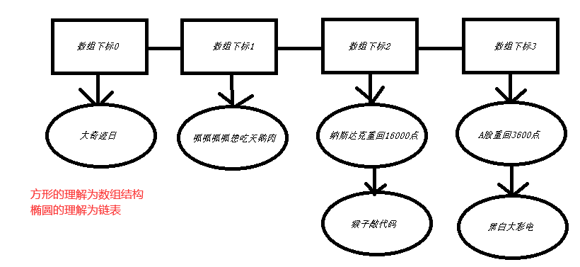

# 1.了解JDK自带的HashMap如何实现
### HashMap的基本数据结构
JDK1.8之前HashMap使用的是【数组+链表】来实现的，实际上是一个“链表散列”的数据结构，即数组和链表的结合体。
在JDK1.8开始将HashMap做了优化，改为【数组+链表或红黑树】，当链表中的节点数据超过八个之后，将链表转为红黑树来提高查询效率

### HashMap插入数据的过程
1. 向HashMap里Put数据时，回根据key来计算hash值，通过hash值得到元素所在数组的下标。
2. 若该数组的当前下标已经存放了其他数据，则在这个下标上的数据以链表的形式存放，新加入的在链表的根节点，最先加入的数据放在链表最尾端。
3. 如果数组中的当前下标没有数据，则直接将该数据放在数组里。

### HashMap的扩容过程
向HashMap里添加元素的时候，会判断当前数组里的元素个数，如果大于等于阈值，则开始扩容。 一般情况，扩容是当前容量的两倍。
+ capacity 即容量，默认16，可以在构造函数里更改。
+ loadFactor 加载因子，默认是0.75，可以在构造函数里更改
+ threshold 阈值。阈值=容量*加载因子。默认12。当元素数量超过阈值时便会


# 2.手动实现HashMap的基本思路
### 计算hashCode值
+ 将字符串转换为 __ascii__ 码，计算总和然后进行取模，从而算出在数组中的下标。
+ 取模是为了减少数组的长度，如果不取模，数组会非常的长，数组是一个 __连续__ 的数据结构。
+ 如果你计算的下标为10000，那么数组长度最少也要有10001，因为当数组满了的时候会扩容乘2或1.5大小的。
```java
public class Test {
    public static void main(String[] args) {
        String str = "黑白大彩电";
        int hashCode = 0;
        for(char c:str.toCharArray()){
            hashCode += (int)c;
        }
        //输出148243
        System.out.println(hashCode);
        //输出3
        System.out.println(hashCode % 8);
        //输出3
        System.out.println(11 % 8);
    }
}
```

### 解决碰撞问题
+ 取模后，意味着下标数最大为 __取模数 - 1__，当你取模数为8时，下标最大为7。这样缩小了数组的长度，也带来了冲突（碰撞）的可能，148243和11对8取模，结果都是3。
+ 这就是为什么是 __数组+[链表或红黑树]__ 的原因了，当hashCode值的取模一样时，会向[链表或红黑树]里追加数据，后写入[链表或红黑树]的数据是根节点，最先写入[链表或红黑树]的在尾端。
+ 两个key的hashCode一样时，分别携带key和value写入[链表或红黑树]中，当根据key取值时，先计算key的hashcode找到数组下标中的[链表或红黑树]，然后到[链表或红黑树]里继续根据key取值。
```java
public class Test {
    public static void main(String[] args) {
        int mod = 4;
        System.out.println(Test.hashCode("黑白大彩电", mod));//输出3
        System.out.println(Test.hashCode("呱呱呱呱想吃天鹅肉", mod));//输出1
        System.out.println(Test.hashCode("猴子敲代码", mod));//输出2
        System.out.println(Test.hashCode("大奇迹日", mod));//输出0
        System.out.println(Test.hashCode("A股重回3600点", mod));//输出3
        System.out.println(Test.hashCode("纳斯达克重回16000点", mod));//输出2
    }

    /**
     * 计算hashCode，并取模
     *
     * @param key
     * @param mod
     * @return
     */
    public static int hashCode(String key, int mod) {
        int hashCode = 0;
        for (char c : key.toCharArray()) {
            hashCode += (int) c;
        }
        return hashCode % mod;
    }
}
```



### 关于取模数大小设置的问题
+ 我们知道数组查询的速度非常快时间复杂度O(1)，但是必须连续，因此数组过长会很吃内存。
+ 链表查询很慢，需要做遍历时间复杂度O(N)，但是写入数据的速度很快，只需要做一个节点的指向即可。
+ __取模数 等于hashMap的数组长度__，所以取模数小，内存占用较少，但是检索速度会慢。当取模数大，内存占用多，检索速度快。


